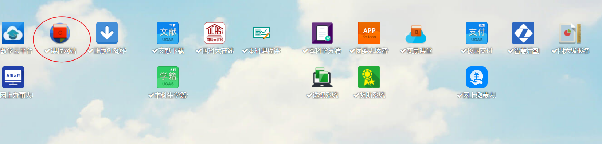
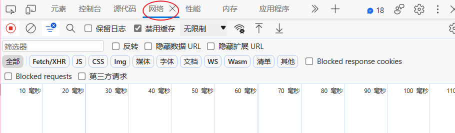
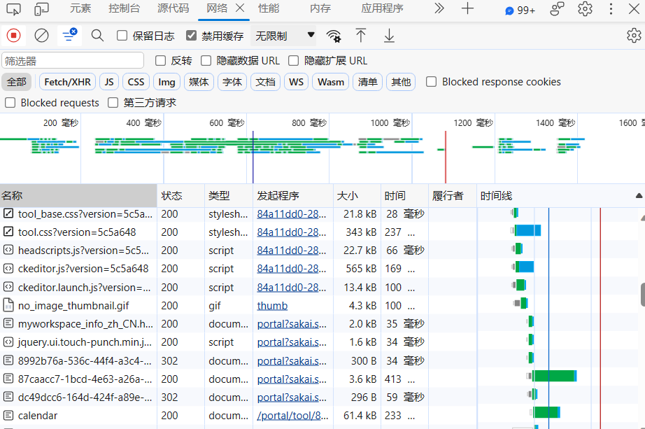
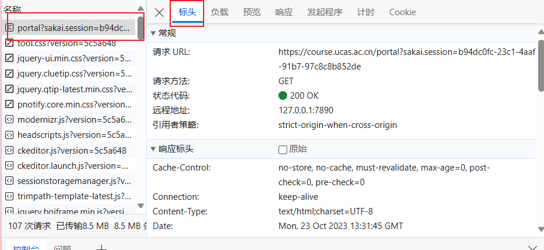
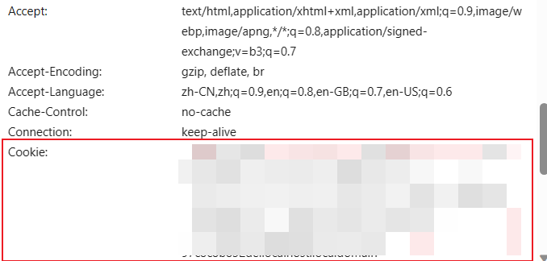
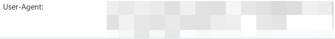

使用时用浏览器打开课程网站，

进入后按F12调取开发者工具，点进上方网络一栏

此时应该是空的，F5刷新一次，会出现以下页面：

随便点进去一个，进入右侧标头一栏

向下滑，直到找到cookies和user-agent一栏。

Cookies：

User-agent:

然后将上述内容分别复制到cookies.txt和user_agent.txt后，运行get_class_url即可。

将会保存一个csv文件和一个xlsx文件，名称均为output，可酌情更改代码选择需要的文件。

只会按照截止日期升序显示晚于爬取日期的作业、对应课程与对应作业的链接（不会过滤掉已提交但未截止的作业）。想通过点击链接的方式直接转到作业页面需要提前打开sep中的“我的课程”**(不是只进入SEP，而是需要进入我的课程)**

#### 补充说明：若运行一次程序未成功请尝试在运行一次